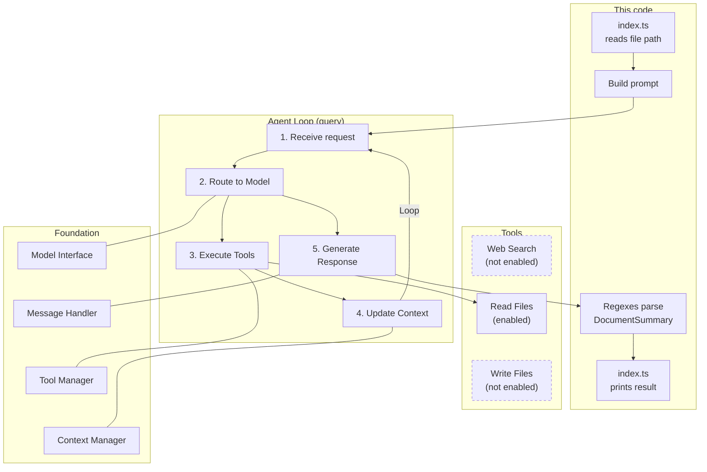

# Claude Agent SDK: Document Summarizer

A minimal example for the article *Introduction to the Claude Agent SDK with Implementation Example*.

The agent receives a file path, reads the file with the SDK's built-in `Read` tool, and returns a structured summary (key points plus a short summary). You write no tool-call handling: `query()` runs the whole agent loop.

## Project Structure

```
src/
├── document-summarizer.ts   # The agent: summarizeDocument()
└── index.ts                 # Small CLI runner
documents/
└── sample-document.md       # Placeholder document to try it with
```

## Prerequisites

- Node.js 20 or newer
- An Anthropic API key from https://console.anthropic.com/

## Quick Start

```bash
git clone https://github.com/<your-user>/claude-agent-sdk-document-summarizer.git
cd claude-agent-sdk-document-summarizer
npm install
cp .env.example .env     # then put your API key into .env
npm start
```

Summarize your own file by passing its path:

```bash
npm start -- ./documents/my-notes.md
```

## Expected Output

```
Summarizing: ./documents/sample-document.md

Key Points:
  1. ...
  2. ...
  3. ...

Summary:
  ...
```

The exact wording varies from run to run.

## How It Works

1. `summarizeDocument(filePath)` builds a prompt that asks for a fixed markdown format (`## Key Points` and `## Summary`).
2. `query()` from `@anthropic-ai/claude-agent-sdk` runs the agent with only the `Read` tool allowed.
3. The code loops over the streamed messages until it receives a `result` message with subtype `success`.
4. Regular expressions split that text into a typed `DocumentSummary` object (`keyPoints`, `summary`, `raw`).

The diagram below follows the layers and numbered steps of the Claude Agent SDK architecture figure (Agent Loop, Tools, Foundation). Each node names the part of this project where that step happens. Solid boxes are used by this example; dashed boxes are part of the SDK but not enabled here.



How the diagram maps to the code:

| Diagram | Code |
| --- | --- |
| 1. Receive request | `query({ prompt, options })` in `summarizeDocument()` |
| 2. Route to Model | `options.model`, taken from `ANTHROPIC_MODEL` |
| 3. Execute Tools | The agent calls `Read` on the file path (`allowedTools: ["Read"]`) |
| 4. Update Context | The SDK appends the file content to the conversation and loops again |
| 5. Generate Response | The `result` message with subtype `success` (`message.result`) |
| Message Handler | The `for await (const message of result)` loop |

Because parsing relies on those exact headers, the prompt and the regexes are coupled. If the headers are missing, `keyPoints` and `summary` come back empty, but `raw` still holds the full response.

## Troubleshooting

- `ANTHROPIC_MODEL is not set`: you have not created `.env`. Run `cp .env.example .env`.
- Authentication errors: check that `ANTHROPIC_API_KEY` is set correctly in `.env`.

## License

MIT
